# *第五章*:用 MLflow 管理模型

在本章中，您将了解 MLflow 中模型管理的不同功能。您将了解 MLflow 中的模型生命周期，我们将解释如何将其与您的常规开发工作流集成，以及如何创建 MLflow 中不可用的定制模型。模型生命周期将与 MLflow 的模型注册特性一起引入。

具体来说，我们将了解本章的以下部分:

*   了解 MLflow 中的模型
*   探索 MLflow 中的模型风格
*   管理模型和签名模式
*   使用模型注册表管理生命周期

从工作台的角度来看，我们希望使用 MLflow 来管理我们的模型，并实现一个清晰的模型生命周期。利用 MLflow 向我们的基准测试添加托管模型功能将提升我们的**机器学习工程**解决方案的质量和运营。

# 技术要求

对于本章，您将需要以下内容:

*   最新版本的 Docker 安装在您的机器上。如果你还没有安装，请按照[https://docs.docker.com/get-docker/](https://docs.docker.com/get-docker/)的说明进行操作。
*   安装了最新版本的`docker-compose`。请按照 https://docs.docker.com/compose/install/.的指示
*   在命令行中访问 Git，并按照[https://Git-SCM . com/book/en/v2/Getting-Started-Installing-Git](https://git-scm.com/book/en/v2/Getting-Started-Installing-Git)中的描述进行安装。
*   访问 Bash 终端(Linux 或 Windows)。
*   访问浏览器。
*   Python 3.5 以上版本已安装。
*   本地安装您的机器学习工作台的最新版本，在 [*第三章*](B16783_03_Final_SB_epub.xhtml#_idTextAnchor066) ，*您的数据科学工作台*中描述。

# 了解 MLflow 中的模型

在 MLflow 平台上，有两个主要组件可用于管理模型:

*   **模块**:该模块管理平台上的格式、库、标准执行模块。它支持各种最常用的机器学习模型:sklearn、XGBoost、TensorFlow、H20、fastai 等。它具有管理模型的输出和输入模式以及简化部署的特性。
*   **模型注册**:这个模块处理一个模型生命周期，从注册和标记模型元数据开始，这样它就可以被相关系统检索到。它支持不同状态的模型，例如，实时开发、测试和生产。

MLflow 模型的核心是模型的打包格式。MLflow 模型打包的主要目标是将模型类型从执行模型的环境中分离出来。MLflow 模型的一个很好的类比是，它有点像模型的 **Dockerfile** ，其中您描述了模型的元数据，上游的部署工具能够基于规范与模型进行交互。

从*图 5.1* 的图表中可以看出，一边是您的模型库，例如 TensorFlow 或 sklearn。MLflow 的核心是 MLflow 模型格式，它能够以多种风格(模型格式)提供，以满足内部和云中不同类型的推理工具的需求:

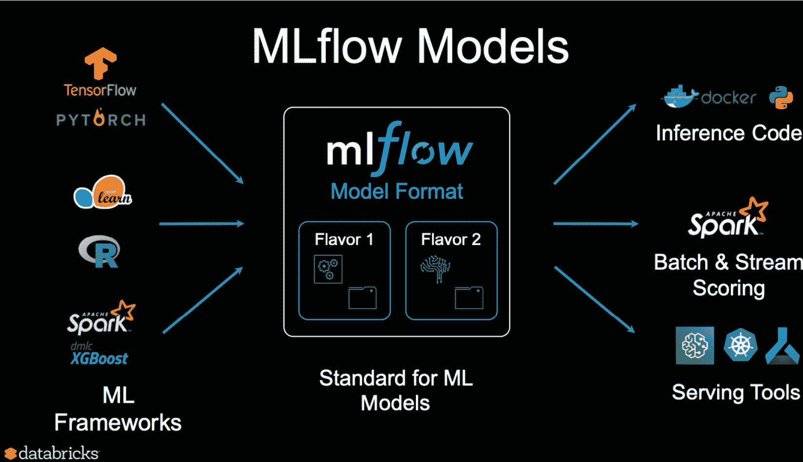

图 5.1–物流模型图

*图 5.1* 摘自网址[https://www.infoq.com/presentations/mlflow-databricks/#](https://www.infoq.com/presentations/mlflow-databricks/#)。

MLflow 模型定义的核心部分是 MLflow 模型文件，如下一个屏幕截图所示:

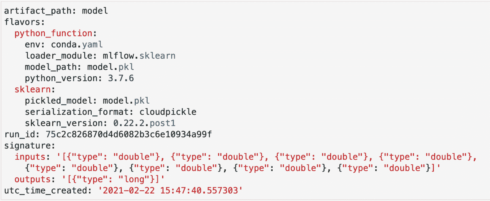

图 5.2–多模型文件示例

一个 MLmodel 示例可在*图 5.2* 中看到，并提供以下信息:

*   **run_id** :这是对允许创建模型的项目的模型运行的引用。
*   **time_created** :模型创建时的时间戳。
*   `pyfunc`ml flow 提供的模型。
*   **签名**:这是 MLmodel 的组件，它定义了模型签名，并允许您以某种方式输入模型的推理过程。它允许对需要匹配模型签名的输入数据进行验证。

`pyfunc`。该函数在任何支持 Python 的环境中都受支持，从而为模型的部署者提供了在登录 MLflow 后如何最好地运行模型的灵活性:

1.  在项目的 GitHub repo 中，请转到`Gradflow`文件夹，运行以下命令启动本章的环境:

    ```
    make 
    ```

2.  You can run all the cells including the model cell depicted in *Figure 5.3*: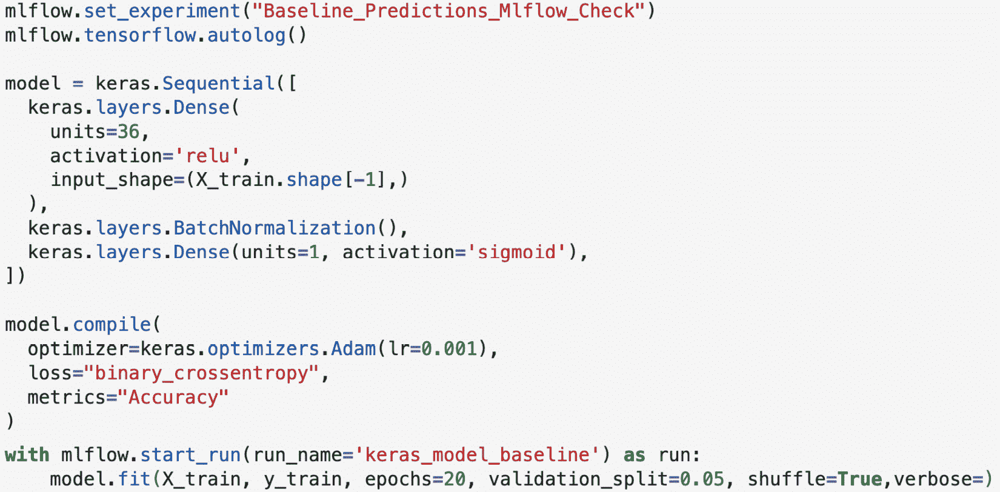

    图 5.3–多模型文件示例

    *图 5.3* 中的模型应该与 MLflow 中实验管理 [*第 4 章*](B16783_04_Final_SB_epub.xhtml#_idTextAnchor081) *中使用的模型非常相似。使用`mlflow.start_run`，您可以开始在 MLflow 中记录您的模型，并使用平台的固有功能来捕获正在开发的模型的相关细节。*

3.  You can now explore the `MLmodel` file in MLflow: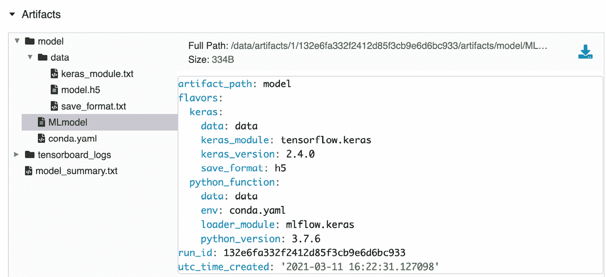

    图 5.4–多模型文件示例

4.  Explore the `conda` file in MLflow: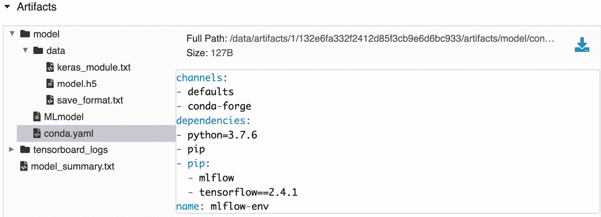

    图 5.5–多模型文件示例

5.  Load the model as `MLflow Pyfunc` for prediction:

    ```
    import mlflow
    logged_model = ‘/data/artifacts/1/132e6fa332f2412d85f3cb9e6d6bc933/artifacts/model’
    # Load model as a PyFuncModel.
    loaded_model = mlflow.pyfunc.load_model(logged_model)
    # Predict on a Pandas DataFrame.
    import pandas as pd
    loaded_model.predict(pd.DataFrame(X_test))
    ```

    或者，可以使用`/data/model/model.h5 file`将模型加载到本地 H5 Keras 格式，并加载到完全不同的应用，如图*图 5.4* 所示。

在本节介绍了MLflow 中模型的概念后，我们接下来将更深入地研究 ml flow 中不同类型的模型。

# 探索 MLflow 中的模型风味

MLflow 中的模型风格基本上是 MLflow 支持的不同库的不同模型。该功能允许 MLflow 使用每个特定模型的本地库处理模型类型，并支持模型的一些本地功能。下面的列表选择了一些有代表性的模型来描述和说明 MLflow 中可用的支持:

*   `mlflow.tensorflow` : TensorFlow 是目前使用最多的库之一，尤其是面向深度学习的库。MLflow 通过以 TensorBoard 格式保存日志，与模型格式和监控功能进行了本机集成。对于 TensorFlow 模型，MLflow 中支持自动记录。*图 5.5* 中的 Keras 模型是 MLflow 中张量流支持的一个很好的例子。
*   `mlflow.h2o` : H2O 是一个完整的机器学习平台，面向模型的自动化，与 MLflow 有一些重叠的功能。MLflow 提供了以 H2O 本地格式加载(`load_model`)和日志模型(`log_model`)的能力，允许工具之间的互操作性。不幸的是，截至目前的 MLflow 版本，您无法在`h2o`型号上使用自动登录:

    ```
    mlflow.h2o.load_model(...) mlflow.h2o.log_model(...)
    ```

*   `mlflow.spark` : MLflow 通过两个主接口与 Apache Spark 库原生集成:用于机器学习的 Spark MLlib 和 MLeap 平台(https://combuste . github . io/ml EAP-docs/)。Mleap 更像是一个部署平台，而 MLlib 更像是一个可以添加到项目中的库。

MLflow 支持一个非常全面的风格/格式列表，它们的用法和支持可以在这里阅读:[https://www.mlflow.org/docs/latest/python_api/index.html.](https://www.mlflow.org/docs/latest/python_api/index.html
)

## 定制型号

我们可以深入下一段代码和定制的`RandomPredictor`模型。只要你用`fit`和`predict methods`为一个类提供一个接口，你就可以拥有自己定制的 MLflow 模型:

```
class RandomPredictor(mlflow.pyfunc.PythonModel):
  def __init__(self):
    pass
  def fit(self):
    pass
  def predict(self, context, model_input):
    return model_input.apply(
        lambda column: random.randint(0,1))
```

在前面的`class`中，我们基本上使用了一个随机概率，它可以作为一个系统中的样本模型，在这个系统中，你要确保你的模型比随机模型更好。

在这个部分，我们介绍了不同类型的模型风格和定制模式的创建。接下来，我们将研究 MLflow 的一些模式和签名特性。

# 管理模型签名和模式

MLflow 的一个重要特性是为模型的输入和输出模式提供抽象，以及在预测和训练期间验证模型数据的能力。

如果在预测过程中您的输入与模型的模式和签名不匹配，MLflow 将引发错误:

1.  接下来我们将看一个数字分类的简单模型的代码清单(数据集的详细信息可以在这里找到:[https://archive . ics . UCI . edu/ml/datasets/Optical+Recognition+of+handled+Digits](https://archive.ics.uci.edu/ml/datasets/Optical+Recognition+of+Handwritten+Digits))。以下代码将图像展平成熊猫数据帧，并使模型适合数据集:

    ```
    from sklearn import datasets, svm, metrics from sklearn.model_selection import train_test_split import mlflow digits = datasets.load_digits() n_samples = len(digits.images) data = digits.images.reshape((n_samples, -1)) clf = svm.SVC(gamma=0.001) X_train, X_test, y_train, y_test = train_test_split(     data, digits.target, test_size=0.5, shuffle=False) mlflow.sklearn.autolog() with mlflow.start_run():     clf.fit(X_train, y_train)
    ```

2.  We’ll look at the previous code listing, which you can run in a new notebook and navigate through the MLflow UI to investigate in more depth the MLmodel generated in *Figure 5.6*: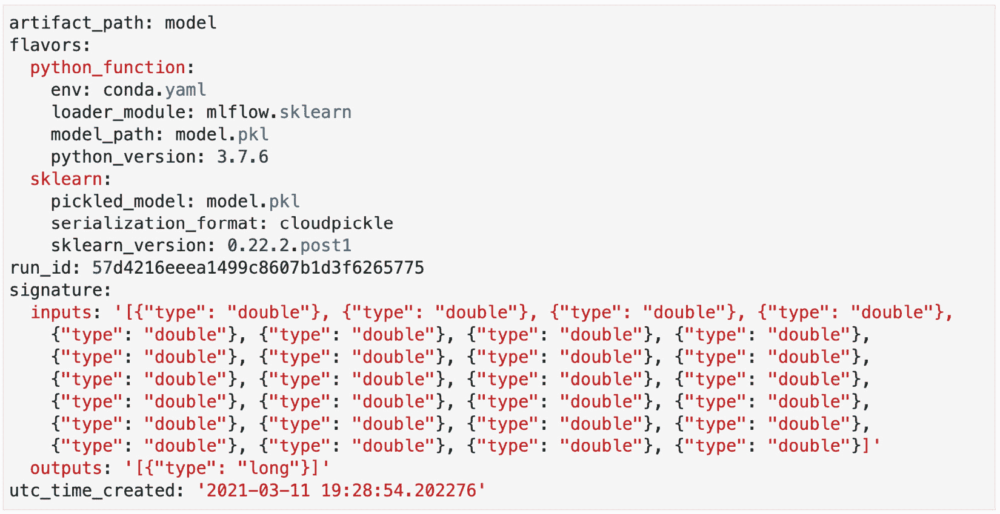

    图 5.6–多模型文件示例

3.  MLmodel 文件包含输入和输出文件的 JSON 签名。对于一些自动记录的口味，我们将无法自动推断签名，因此您可以在记录模型时提供内联签名:

    ```
    # flatten the images from mlflow.models.signature import infer_signature with mlflow.start_run(run_name=’untuned_random_forest’):     …     signature = infer_signature(X_train,          wrappedModel.predict(None, X_train))     mlflow.pyfunc.log_model(“random_forest_model”,                              python_model=wrappedModel,                              signature=signature)
    ```

在前面的代码块中，模型的签名由`infer_signature` 方法提供。当通过`log_model`登录模型时，提供签名。签名与模型一起记录的一个重要优点是，它们可以作为模型的文档和元数据。第三方系统可以使用元数据，并通过验证数据或为模型生成文档来与模型交互。

在本节中，我们介绍了 MLflow 模型的模型模式和签名特性。我们现在将转移到这个领域中的另一个关键模块，即模型注册中心。

# 引入模型注册表

**MLflow Model Registry** 是 MLflow 中的一个模块，它包括一个模型的集中存储，一个允许在注册表中管理模型生命周期的 API。

机器学习模型开发人员的典型工作流程是获取训练数据；清理、处理和训练模型；并且从那里开始，移交给部署模型的系统或人员。在非常小的环境中，你有一个人负责这个功能，这是非常琐碎的。当团队中模型的种类和数量开始扩大时，挑战和摩擦就开始出现了。机器学习开发者提出的关于存储和检索模型的常见摩擦点的选择如下:

*   大型团队中的协作
*   在生产中逐步淘汰过时的模型
*   一个模型的出处
*   缺乏模型的文档
*   识别模型的正确版本
*   如何将模型与部署工具集成

**MLflow Model Registry** 背后的主要思想是在一个组织中提供一个中央存储模型，所有相关的模型都存储在这里，并且可以由人和系统访问。一个很好的类比是模型的 Git 存储库以及相关的元数据和模型的集中式状态管理。

在 MLflow UI(在您的本地环境中可用)中，您应该单击标签为**型号**的**实验**右侧的选项卡，如箭头所示:

1.  Through this module, you are able to list all the models registered, search by name, or create by name. For each model, you can see the label of the latest version and the specific versions that are in staging or production: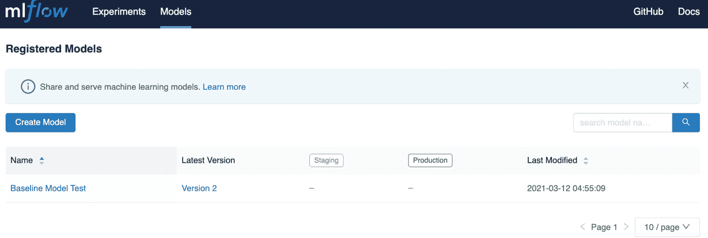

    图 5.7–模型注册用户界面

2.  A new model can be created by clicking on the **Create Model** button where a relevant name can be given to a specific model as shown in *Figure 5.8*: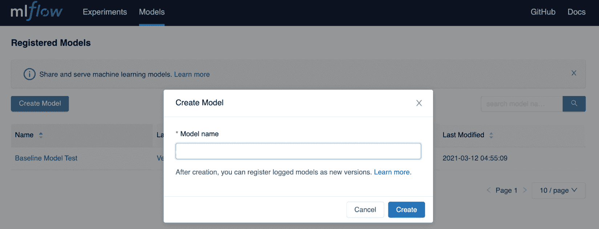

    图 5.8–模型注册界面–创建模型

3.  您还可以通过进入**实验**模型并选择您的一个模型来在 MLflow 中创建模型，并从那里具体决定注册该模型。您必须将您的跑步与现有模型相关联，或者创建一个新的模型名称，以便与此特定类型的模型相关联:

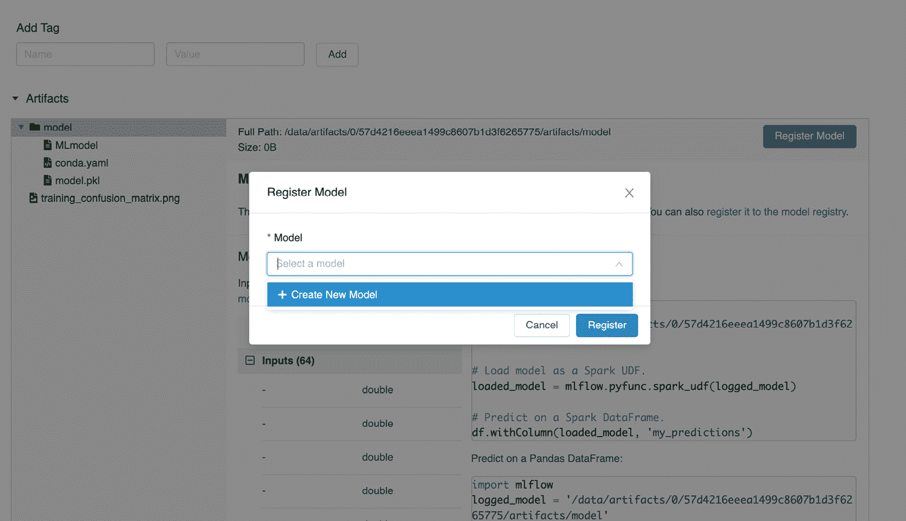

图 5.9–模型跟踪用户界面–创建新模型

当您添加新模型时，MLflow 会自动增加版本，并将此版本标记为最新版本，组织中的每个人都可以针对给定问题向注册表查询模型的最新版本。

## 将您的最佳型号添加到 Mode l 注册表

在 MLflow 的 UI 中可以做的一切也可以通过 MLflow API 实现。

我们可以快速回到我们的股票市场预测用例，将我们的第一个基线模型添加到模型注册表中，运行本章回购中提供的`hyperopt_optimization_logistic_regression_mlflow.ipynb notebook`，并根据 F1 得分指标按降序对运行进行排序，如图*图 5.10* 所示:

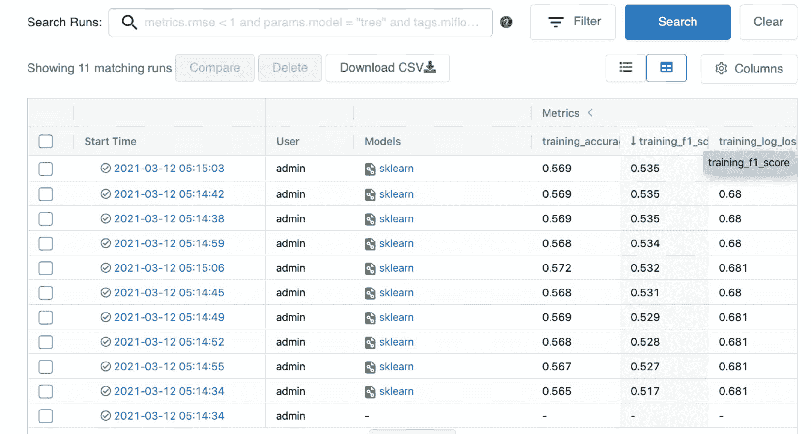

图 5.10–选择最佳模型

从那里，您应该能够注册名为`BTC StockPrediction`的最佳模型，如图*图 5.11* 所示:

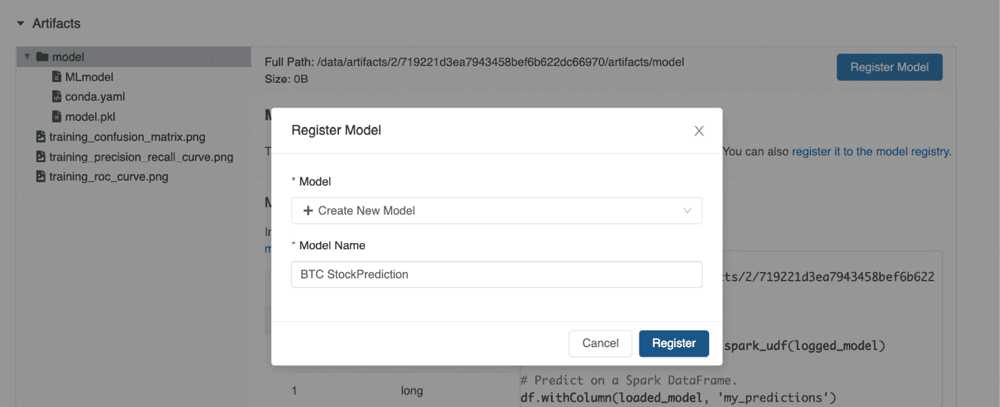

图 5.11–命名您的模型

通过返回模型模块，您会注意到，如图*图 5.12* 所示，您在**版本 1** 下新创建的模型:

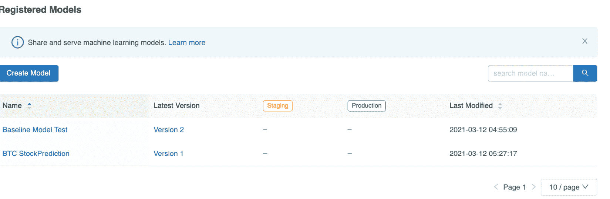

图 5.12-注册型号

在介绍了模型注册的功能之后，在下一节中，我们将描述一个模型开发生命周期来帮助组织模型的管理。

# 管理模型开发生命周期

当在不止一个模型开发人员的团队中工作时，管理模型生命周期是非常重要的。对于多个模型开发人员来说，在同一个项目中尝试不同的模型是很常见的，让一个评审者决定最终进入生产的模型是非常重要的:

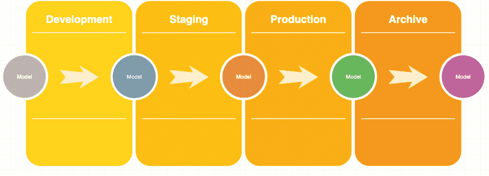

图 5.13–模型开发生命周期示例

如果使用与图 5.13 中*所示相似的生命周期，则中的模型在其生命周期中可以经历以下阶段:*

*   **开发**:模型开发人员仍然在探索和尝试不同的方法，仍然在试图为他们的机器学习问题找到合理的解决方案的状态。
*   **Staging** :可以用量产型流量自动测试模型的状态。
*   **生产**:当模型准备好处理实际生产流量时。
*   **存档**:当模型不再服务于最初开发时的业务目的时，它将被存档，其元数据将被存储以备将来参考或遵从。

例如，*图 5.14* 中所示的评审员或主管可以将模型从**开发**状态转移到**准备**状态，以便在测试环境中进一步部署，如果评审员批准，该模型可以过渡到生产环境中:

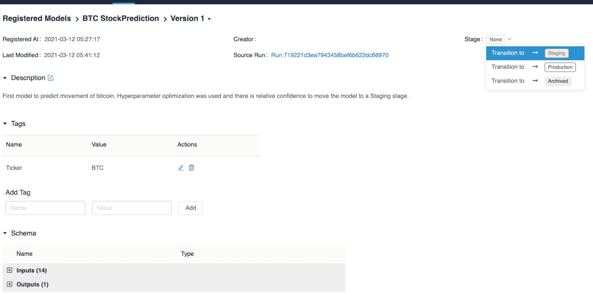

图 5.14–模型开发生命周期示例

当从 MLflow 中的一个状态转换时，您可以选择将现有状态中的模型发送到下一个状态:

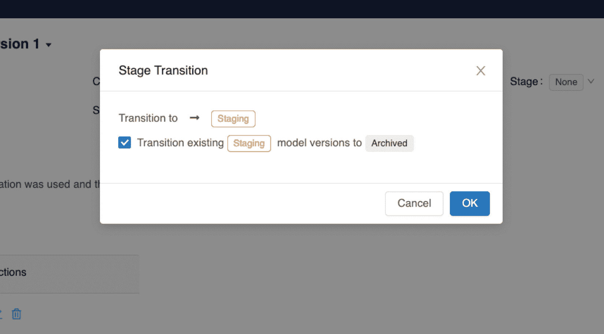

图 5.15–物流中的阶段转换

在一个成熟的环境中，从**准备阶段**到**生产阶段**的过渡是自动完成的，我们将在本书接下来的章节中演示。

在本节中，我们总结了与 MLflow 中的模型相关的特性的描述。

# 总结

在本章中，我们首先介绍了 MLflow 中的模型模块以及对不同算法的支持，从基于树的算法到线性算法再到神经算法。我们在模型的日志和度量以及定制度量的创建方面接触到了支持。

在前两节中，我们介绍了模型注册中心模型，以及如何使用它来实现模型生命周期以管理我们的模型。

在本书的下一章和下一节中，我们将重点关注将迄今为止学到的概念应用到现实生活系统中，并且我们将为生产环境构建一个机器学习系统。

# 延伸阅读

为了巩固您的知识并深入了解本章介绍的概念，您应该查看以下链接:

*   [https://www.mlflow.org/docs/latest/models.html](https://www.mlflow.org/docs/latest/models.html)
*   [https://www.mlflow.org/docs/latest/model-registry.html](https://www.mlflow.org/docs/latest/model-registry.html)
*   [https://www . slide share . net/Hadoop _ Summit/introducing-ml flow-an-open-source-platform-for-the-machine-learning-life cycle-for-on prem-or-in-the-cloud](https://www.slideshare.net/Hadoop_Summit/introducing-mlflow-an-open-source-platform-for-the-machine-learning-lifecycle-for-onprem-or-in-the-cloud)