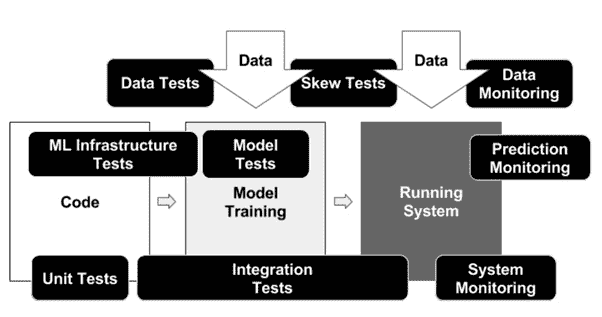
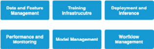
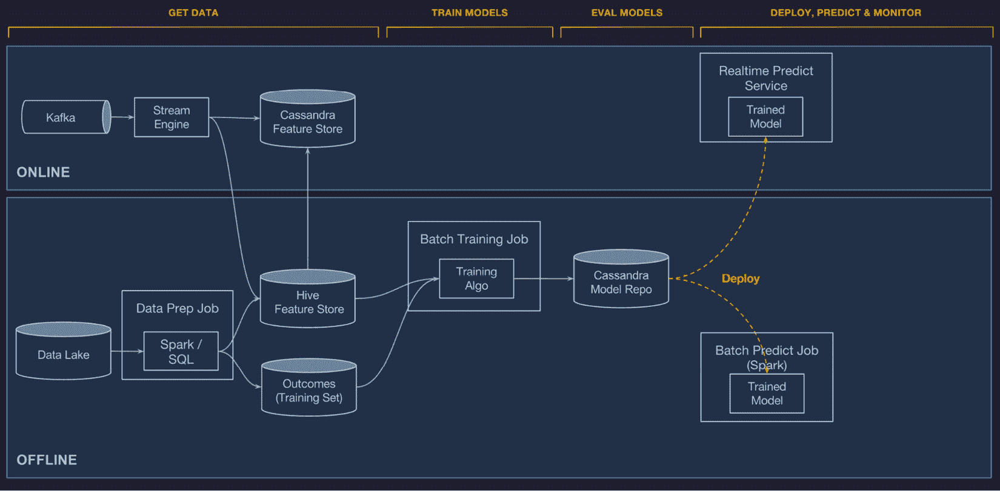
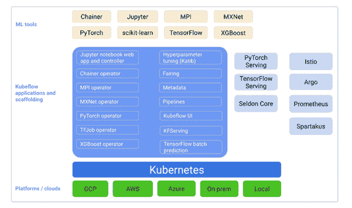
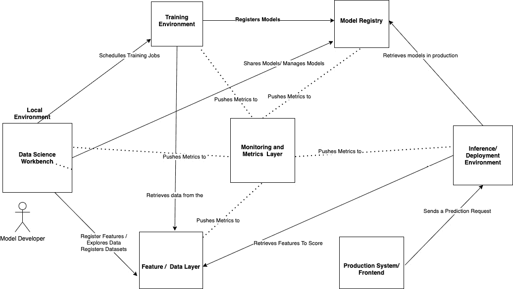

# 六、ML 系统架构简介

在这一章中，你将在**软件工程** ( **SWE** )的大背景下学习**机器学习** ( **ML** )系统架构的一般原理，以及以可靠的方式在生产中部署模型的常见问题。你也将有机会跟随我们的 ML 系统的设计。我们将简要地看看如何使用 MLflow，结合其他相关工具，我们可以建立可靠的和可伸缩的 ML 平台。

具体来说，我们将了解本章的以下部分:

*   理解 ML 系统和项目的挑战
*   调查最先进的 ML 平台
*   构建 PsyStock ML 平台

您将遵循一个理解问题的过程，研究行业内领先公司的不同解决方案，然后开发您自己的相关架构。这个三步走的方法可以移植到你将来想要开发的任何 ML 系统中。

# 技术要求

对于本章，您需要满足以下先决条件:

*   最新版本的 Docker 安装在您的机器上。如果您尚未安装，请按照[https://docs.docker.com/get-docker/](https://docs.docker.com/get-docker/)中的说明进行操作。
*   安装了最新版本的`docker-compose`。请按照[https://docs.docker.com/compose/install/](https://docs.docker.com/compose/install/)的指示。
*   在命令行中访问 Git，并按照[https://Git-SCM . com/book/en/v2/Getting-Started-Installing-Git](https://git-scm.com/book/en/v2/Getting-Started-Installing-Git)中的描述进行安装。
*   访问 Bash 终端(Linux 或 Windows)。
*   访问浏览器。
*   Python 3.5 以上版本已安装。
*   如第 3 章 、*您的数据科学工作台*中所述，在本地安装您的 ML 平台的最新版本。

# 了解 ML 系统和项目面临的挑战

利用 ML 实现一个产品可能是一项艰巨的任务，因为书中需要围绕 ML 系统架构的最佳实践引入一些新概念。

到目前为止，在本书中，我们已经展示了 MLflow 如何使日常模型开发人员拥有一个平台来管理 ML 生命周期，从模型开发的迭代到将他们的模型存储在模型注册中心。

总之，在这个阶段，我们已经成功地为模型开发人员创建了一个平台，来制作他们的模型，并在一个中央存储库中发布模型。这是开始释放所创建模型的商业价值潜力的理想阶段。在 ML 系统中，从模型开发到生产模型的飞跃，需要思维和方法的改变。在释放价值和制作模型之后，开发阶段开始了，在这个阶段，拥有一个 ML 系统架构可以为模型的部署和操作定下基调。

ML 系统是传统 SWE 领域的一个专门化，因此我们能够并且应该利用 SWE 领域的知识体系来设计我们的系统。SWE 中与我们的上下文相关的概念如下:

*   **分离关注点**:一个完整的系统应该被分离成不同的组件。系统的每个组件都应该是独立的，专注于做好一件事。例如，训练组件应该专门用于训练，而不是同时进行评分。
*   **自治**:系统的每个组件都应该是独立的自治单元，可以独立部署。例如，您的 API 系统的部署应该独立于训练系统的部署。
*   **弹性**:关注点分离和模块化的一个结果是，我们必须确保如果更大系统的一个组件有故障，这不会影响独立的组件。如果一个机器平台的批量评分机制被破坏了，应该不会影响到实时系统。
*   **可伸缩性**:我们应该能够独立地伸缩我们系统的不同组件，并且与它的工作负载相一致。
*   **可测试性**:这代表一个系统被测试的能力，以及它的功能被一组代表性的输入所验证的能力。在 ML 系统中，考虑到模型的不确定性，这尤其困难。
*   **连续部署/交付**:这代表了在更短的周期内部署系统的能力，在 ML 的情况下，代码、配置、模型或数据的变化之间几乎没有摩擦，以拥有系统的新版本。
*   **可组合性**:我们应该能够在未来的项目中重用我们系统的组件，以增加投资回报。因此，ML 工程师需要确保正在开发的代码和组件可以很容易地重用和/或与其他系统互操作。
*   **可维护性**:这是一个系统可以被修改、修正和改进以满足和适应变化的环境需求的容易程度。

在这个阶段，我们可以简单地介绍和提炼我们的股票预测用例，在 PsyStock 公司开发我们的 ML 平台。

基于迄今为止在原型模型预测比特币价格方面所做的工作，该公司的业务发展部门决定推出其第一款产品，作为加密货币预测 API 的 T2，因为加密货币正在成为企业界的一项流行技术。组建了一个团队，决定调查挑战和最先进的平台，然后设计公司自己的平台。

一个 ML 项目通常涉及公司的许多部门。想象 PsyStock 的假设案例，一个典型的 ML 项目团队包括以下利益相关者:

*   **数据科学团队**:负责构建和开发模型，目标是实现对加密货币价格和市场走势预测的最高准确性。
*   **ML/数据工程团队**:负责工程组件，包括数据采集、准备、训练和部署，并对系统在生产中的正确部署和运行感兴趣。
*   **基础设施团队**:负责提供计算和基础设施资源。期望系统不会给团队带来运营负担。
*   **产品团队**:提供与网络平台和公司整体软件的集成，并推动特征创建，确保快速推理速度。
*   **业务开发/营销团队**:包装和营销产品，监控产品的业务表现。

在下一节中，我们将了解 ML 系统和项目中的一般挑战。

ML 是一项重要的技术应用，有助于在使用数据的组织中释放价值。在商业世界的 ML 应用中，没有定义标准的实践，大量的组织努力在生产中得到 ML 支持的产品。

在现实世界中，将模型转移到生产环境中的一种简单方法包括以下步骤:

1.  Data scientist 在笔记本环境中生成一个模型，并在 r。
2.  数据科学家与工程团队共享笔记本，表示他们准备好将模型投入生产。
3.  工程团队用一种他们能理解的语言(在本例中是 Python)重新实现了训练过程。
4.  一个漫长的试错过程，直到数据科学团队和工程团队一致认为，由定制训练系统生成的模型正在生成与原始模型等效的输出。
5.  一个新系统被创建和开发来对系统进行评分，工程团队注意到一个高延迟。模型被发送到重新开发，因为它在当前状态下无法重新开发。

上一段描述的情况比你想象的更常见。在 *D. Sculley 等人的论文《机器学习系统中隐藏的技术债务》(2015)* 中有详细描述。谷歌的一个团队发现了以下与天真地实施 ML 平台相关的风险因素和技术债务:

*   **边界侵蚀** : ML 系统本质上混合了不同逻辑域的信号。在 SWE 中尽可能保持清晰的业务领域逻辑是一项挑战。另一个自然的问题是使用一个模型输出作为第三个模型 *A* 的输入，并且变更可能会对模型 *B* 产生意想不到的影响。
*   昂贵的数据依赖:新鲜、准确、可靠的数据是 ML 系统最重要的组成部分。例如，在加密货币的情况下，为了能够预测，可以结合社交网络情感信号来咨询外部 API。在给定时刻，其中一个数据信号可能不可用，从而导致其中一个组件不可用。现实世界中的数据分布可能会发生变化，导致模型推断与现实世界不相关。
*   **反馈循环**:在某些情况下，模型会影响为训练选择的数据。信用评分就是一个很好的例子。决定谁获得模型的下一次重新训练的信用的模型将从受该模型影响的群体中选择训练数据。在开发模型时，分析模型对地面数据的影响非常重要。
*   **系统级反模式**:众所周知，ML 系统隐藏了不同包的胶水代码，并且没有适当的抽象。在某些情况下，考虑到在笔记本中开发代码的迭代性质，在库中使用多种语言来实现。
*   **配置管理**:在 ML 系统中，关于产生特定结果的配置的信息通常是事后想起的，对于模型和部署的事后分析是至关重要的。不使用已建立的配置管理实践会在 ML 管道中引入错误。
*   **监控和测试**:集成测试和单元测试是 SWE 项目中常见的模式，由于 ML 项目的随机性，它们更难实现。

应对 ML 系统挑战的一个重要实践是，在模型训练期间以及在您的系统上运行时，对流程的关键部分、您的代码添加广泛的测试，如图*图 6.1* 所示:

图 6.1-从 https://research.google/pubs/pub46555/提取的 ML 系统中的测试

*图 6.1* 展示了一种解决技术债务的方法，即通过标准软件实践测试系统的不同部分，并添加专门的监测进行数据预测。重要的新增内容是对数据的测试和对模型的测试，因此测试传入的数据和训练数据，同时能够监控这些测试并确定系统是否通过相关标准是至关重要的。

MLflow 作为一个平台解决了本节中称为 ML 系统问题的一些问题。MLflow 专注于 ML 技术债务的一组特定维度，是创建 ML 平台的良好支柱组件。

在下一节中，我们将看看一些最先进的健壮 ML 工程系统的例子，以指导我们的开发。

# 调查最先进的 ML 平台

从高层次来看，成熟的 ML 系统具有*图 6.2* 中概述的组件。这些组件在理想情况下是独立的，负责系统的一个特定功能:

图 6.2–ML 平台的组件

在 SWE 模块化的引导下，这些通用组件允许我们比较不同的 ML 平台，并指定每个组件的 PsyStock 需求。我们选择用作架构比较参考的组件如下:

*   **数据和特征管理**:数据和特征管理组件负责数据采集、特征生成、存储和服务上游模块。
*   **训练基础设施**:处理模型训练、调度、消费特性和产生最终模型的过程的组件。
*   **部署和推理**:该单元负责模型的部署推理和批量评分。它是系统的外部界面，外部系统可以访问它。
*   **性能和监控**:处理可观察性、不同系统发布的度量以及生产中的监控系统的组件。
*   **模型管理**:管理模型工件版本和模型的生命周期。
*   **工作流管理**:负责编排批处理工作流和处理管道的组件。

在描述了 ML 平台的不同组成部分之后，我们将从优步的米开朗基罗开始看一些例子。

## 了解米开朗基罗

优步是第一批广泛记录其意识到 ML 平台对于释放所产生数据的价值至关重要的公司之一。

优步构建这个平台的内部动机如下:

*   由于将本地模型转化为产品需要大量资源，ML 的影响有限。
*   不可靠的 ML 和数据管道。
*   工程团队必须为手头的系统创建定制的服务容器和系统。
*   无法扩展 ML 项目。

下面的*图 6.3* (取自[https://eng.uber.com/michelangelo-machine-learning-platform](https://eng.uber.com/michelangelo-machine-learning-platform))展示了米开朗基罗的不同组成部分。一个重要的组成部分是优步基础设施的数据部分，将实时数据基础设施与 Kafka 等流系统分离，以从外部获取数据，数据从外部流向训练过程，并从那里以实时和离线模式进行评分。与众不同的特征是批处理世界和实时世界的分离，以及 API 和批处理系统的通用预测服务的存在:

图 6.3-米开朗基罗建筑

我们选择用作架构比较参考的组件如下:

*   **数据和特征管理**:它由一个集中的数据存储组成，具有服务模型和训练模型所需的所有特征。可以实时和批量访问特征数据存储。对于批量场景，他们使用一个名为 Hive 的数据库系统，对于实时，他们使用 Cassandra。
*   **训练基础设施**:分布式训练基础设施，带有一个名为**horo VOD**([https://github.com/horovod/horovod](https://github.com/horovod/horovod))的工具，具有专门定制的组件和增强的报告功能。它为每种类型的模型(深度学习、模型、特征重要性等)提供了定制的指标。训练工作的输出是使用 Cassandra 数据库作为后端的模型 repo。
*   **部署和推断**:通过标准的 SWE 实践(CI/CD，度量监控的回滚，等等)部署的系统，通常被编译为通过优步数据中心提供的工件。接收请求并基于标题信息路由的预测服务使用内部 DSL 预加载正确的模型并提供预测向量，该内部 DSL 能够在要素存储的服务层上查询进一步的数据扩充。
*   **性能和监控**:利用公司的通用集中测井系统。为了监控预测，会生成预测的指标，并记录真实值和差异。以这种方式可以分析和监控模型的误差。
*   **模型管理**:模型被编译成工件并存储在 Cassandra 数据存储中。
*   **工作流管理**:为管道布线提供 API。它包含一个带有 UI 的管理平面，允许管理模型和部署。工作流管理是 API 驱动的，可以从外部用 Python 或 Java 进行管理。

对于像优步这样的公司来说，建立自己的系统的明显优势是灵活性和满足其特定用例的能力。

## 了解 Kubeflow

在某种程度上，Kubeflow 是一个针对 Kubernetes 环境的 ML 生命周期的开源平台。它基本上是一个工具生态系统，这些工具一起工作来提供 ML 平台的主要组件。Kubeflow 最初是由 Google 开发的，目前是一个非常活跃的开源项目。

**Kubernetes** 是领先的开源计算环境之一，可以灵活地为容器化的工作负载分配计算和存储资源。它最初是由谷歌创建的。为了理解 Kubeflow，需要对 Kubernetes 有一个基本的了解。以下官方文档链接包含理解基础知识的先决条件:[https://kubernetes.io/docs/concepts/overview/](https://kubernetes.io/docs/concepts/overview/)。

如图*图 6.4* 所示，它使用了 Kubernetes 的基础，并为 ML 工作流提供了一组应用，在这些应用中，与 Kubeflow 设定的标准兼容的不同工具可以合并，以提供一组一致的服务:

图 6.4–从 https://www.kubeflow.org/docs/started/kubeflow-overview/检索

我们选择用作架构比较参考的组件如下:

*   **数据和特性管理** : Kubeflow 提供了与 Spark 等大数据工具的集成。生态系统中用于数据和特性管理的一个组件叫做 Feast，它是 ML 的一个开源特性。
*   **训练基础设施** : Kubeflow 为常见模型提供特定类型的 Kubeflow 操作员，例如 TensorFlow、PyTorch 和定制模型。训练工作将基本上是具体的 Kubernetes 工作。
*   **部署和推断** : Kubeflow 提供了与 TensorFlow Serving、Seldon Core、KFServing 等第三方工具的多种集成，具有不同的权衡和成熟度级别。
*   **性能和监控** : Prometheus 是一个用于在 Kubernetes 环境中进行监控的通用工具，可以在这个环境中使用。
*   **模型管理**:不是管理模型的特定工具，但是可以添加 MLflow 等工具来覆盖模型管理生命周期。
*   **工作流管理**:工作流管理是通过一个名为 Kubeflow Pipelines 的特定工具来实现的，该工具构建在一个名为 Argo Workflows 的 Kubernetes 通用管道工具之上。它允许在代码中构建多步管道。

在查看了参考架构后，我们现在将花时间利用行业中可用的最新知识来制作我们自己的架构。

# 构建 PsyStock ML 平台

基于对最佳实践和示例参考架构的研究，我们可以为我们的 ML 平台定义一组理想的原则。我们希望在平台中坚持的主要原则如下:

*   **利用** **开放系统和标准**:使用开放系统(如 MLflow 中可用的系统)可以长期灵活地利用开源社区的进步和力量，以较低的成本扩展公司的 ML 平台。
*   **青睐** **可扩展的解决方案**:公司需要为未来的激增做好准备；虽然这是第一个版本，但从训练和角度来看，按需激增的能力需要到位。
*   **集成** **可靠的数据生命周期**:数据是 ML 平台的重心，应该以可靠且可追溯的方式进行规模化管理。
*   遵循 SWE 最佳实践:例如，关注点分离、可测试性、CI/CD、可观察性和模块化。
*   **维护** **供应商和云独立性** : PsyStock 作为一家初创公司，在一个非常动态的环境中和不同的地理位置运营，可以访问不同的云，并且在某些情况下，符合不从给定地理位置移动数据的要求。因此，与云无关并且能够在不同的环境中拥有工作负载是一项竞争优势。

这些原则将允许我们在公司的开放和低成本解决方案中构建我们的系统架构，并允许在内部、云中或本地的不同系统上灵活运行。

我们之前已经定义了预测用例的业务需求，即检测加密货币的移动和价值预测。为了利用这个和其他用例，创建一个 ML 平台对公司来说是至关重要的。

现在，有了对最新系统的研究和描述的知识，我们接下来将定义我们的 ML 平台的特征。

## 描述 ML 平台的特性

创建一个特性规范对于保持开发工作集中在为平台用户释放价值的一小部分特性上是非常重要的。在这一部分，我们将引出实现 ML 平台最佳价值的特性。

在我们的系统中，我们希望能够具有以下特性:

*   **特性:安排训练任务**:数据科学家需要能够使用配置或等效代码为他们的模型安排训练任务。
*   **特性:无缝部署从数据科学工作台**开发的不同模型:公司已经有了在*第三章*、*你的数据科学工作台*开发的数据科学工作台。我们希望能够利用以前完成的所有工作，以便在平台上开发的模型可以部署到生产中。
*   **特性:允许在存在新数据的情况下重新校准模型**:当新数据到达特定位置时，需要自动生成新模型，并将其存储在平台的系统和人员可访问的模型注册表中。
*   **功能:提交和配置批量评分作业**:平台应允许相关用户在有新数据的情况下配置和调度批量作业。
*   **特性:对以下 API 的高效推理基于 API 的评分**:给定一个模型，它应该是平台的一个特性使用模型模式创建匹配的 API。

在讨论了 ML 系统的理想特性之后，我们将在下一节开始从高层次上构建系统。

## 高层系统架构

我们现在将关注于定义我们架构的构建模块以及不同组件之间的不同数据流。

根据上一节指定的功能和原则，我们的 ML 平台和解决方案应包含以下组件，如图 6.5 中的*架构图所示。*

图 6.5–ML 平台的架构图

该图与技术选择无关，因为这将在接下来的各个章节中完成，在这些章节中，将对每个组件的工程进行全面探讨。

1.  **数据和特征管理**:由**特征/数据层**执行，从工作台接收特征注册，并允许从工作台注册数据集。数据层向训练环境提供数据。
2.  **训练基础设施**:训练基础设施组件允许根据数据科学工作台的请求安排工作训练。
3.  **部署和推理**:部署环境通过数据层中的数据或通过生产系统的请求，以批处理或实时方式执行模型。
4.  **性能和监控**:这是通过监控和度量的中心组件完成的，围绕该组件的所有系统都将度量发布到该组件中。
5.  **模型管理**:由**模型注册**组件封装，包含一个商店和相关的生命周期项目。输入主要来自训练工作和数据科学工作台。
6.  **工作流管理**:这是一个允许协调不同系统的组件。例如，它允许调度作业和依赖性管理，强制执行顺序。例如，推理批处理作业只能在训练作业之后执行。这可以通过使用 Cron 系统的操作系统或通过更复杂的工作流工具(如 Airflow)来实现。

接下来，我们将简要介绍如何利用 **MLflow** 实现本节概述的想法。

## MLflow 和其他生态系统工具

MLflow 是一个由开源社区创建的工具，旨在解决 ML 系统的开放系统中的差距，专注于可再现性、模型管理和部署。MLflow 绝不是一个完整的工具；它需要其他组件，并且在充分利用其优势时，它是 ML 解决方案的核心部分。

近年来，像 Kubeflow 这样的系统已经出现在 Kubernetes 世界中，帮助管理 ML 系统的基础设施方面，并成为实际的部署环境。

**Minio** 是一个存储系统，随 Kubeflow 一起提供，它将用作元数据和数据集的不可知存储机制，并为云和本地环境上的存储提供抽象。

确定了行业中关于 ML 平台的最佳实践，概述了我们的需求，并且在本节中，构建了我们的 ML 平台，我们将在本书的接下来四章中构建我们平台的每个组件。

# 总结

在这一章中，我们介绍了构建 ML 系统所涉及的概念，描绘了利益相关者，确定了常见问题和最佳实践，并概述了初始架构。我们在数据层、建模和推理层确定了 ML 系统架构的关键构件。强调了组件之间的互连，并概述了功能规范。

我们还讨论了如何在您的 ML 平台中利用 MLflow，以及可以通过其他参考工具补充的缺点。

在本书的下一章和下一节中，我们将把重点放在将目前学到的概念应用到现实生活中的系统上，并且我们将通过实现 PsyStock ML 平台的架构来进行实践。我们将有一章专门讨论每一个组件，从规范开始到组件的实现，包括实际的例子。

# 延伸阅读

为了加深您的知识，您可以参考以下链接中的文档:

*   https://www.mlflow.org/docs/latest/models.html
*   技术债利息高——[https://papers . nips . cc/paper/2015/file/86 df 7 dcfd 896 fcaf 2674 f 757 a 2463 EBA-paper . pdf](https://papers.nips.cc/paper/2015/file/86df7dcfd896fcaf2674f757a2463eba-Paper.pdf)
*   **CS 329S** : ML 系统设计，*芯片虎眼*—[https://cs329s.stanford.edu](https://cs329s.stanford.edu)，2021