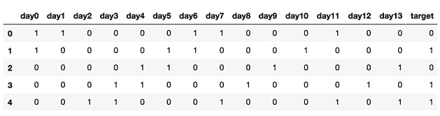
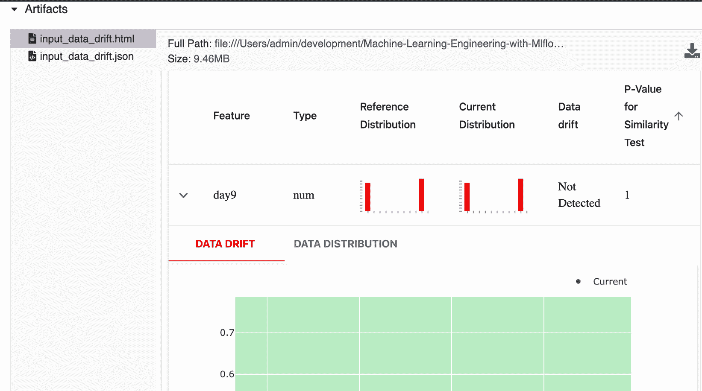
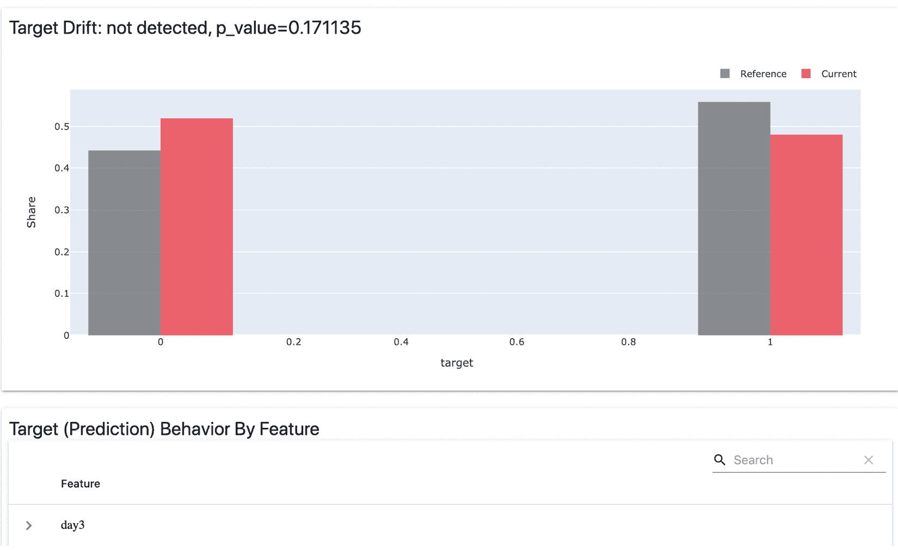
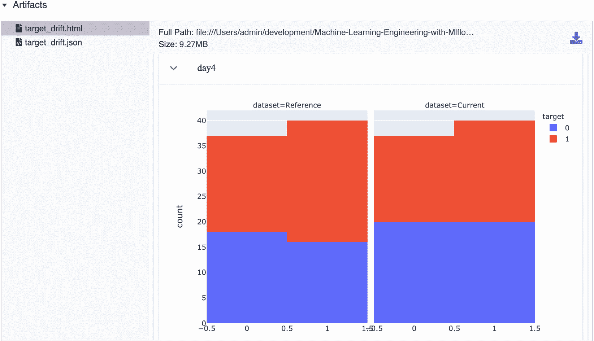
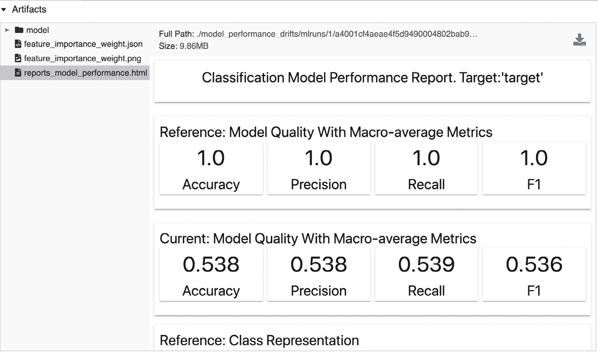
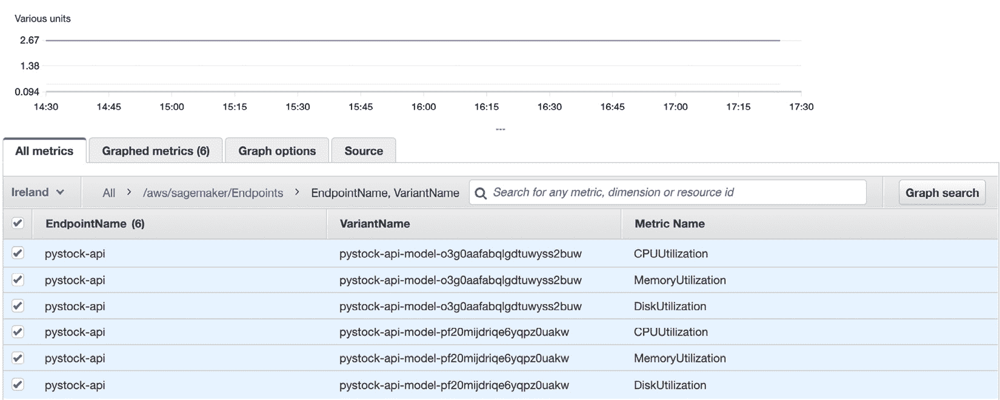
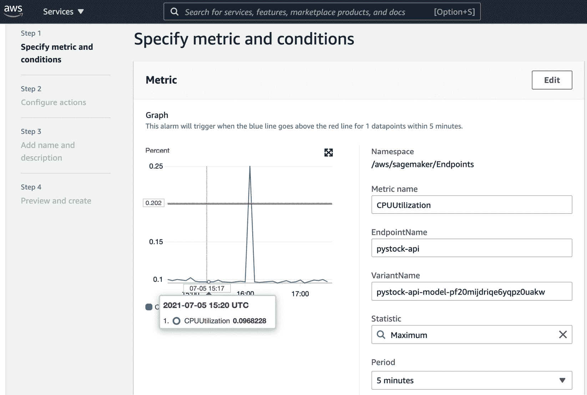

# 十一、性能监控

在本章中，你将了解到**机器学习(ML)** 操作的重要和相关领域，以及如何使用该领域的最佳实践和已知的操作模式，确保本书迄今为止开发的生产系统平稳运行。我们将理解 ML 中操作的概念，并查看 ML 系统中监控数据质量的度量标准。

具体来说，我们将了解本章的以下部分:

*   ML 模型的性能监控概述
*   监控数据漂移和模型性能
*   监控目标漂移
*   基础设施监控和警报

我们将介绍一些实用的参考工具，用于监控 ML 系统的性能和可靠性。

# 技术要求

对于本章，您将需要以下先决条件:

*   最新版本的 Docker 安装在您的机器上。如果你还没有安装，请按照[https://docs.docker.com/get-docker/](https://docs.docker.com/get-docker/)的说明进行操作。
*   安装了最新版本的`docker-compose`。为此，请遵循 https://docs.docker.com/compose/install/.的指示
*   在命令行访问 Git，可以按照[https://Git-SCM . com/book/en/v2/Getting-Started-Installing-Git](https://git-scm.com/book/en/v2/Getting-Started-Installing-Git)中的描述进行安装。
*   访问 Bash 终端(Linux 或 Windows)。
*   访问浏览器。
*   Python 3.8+已安装。
*   如第 3 章 *、您的数据科学工作台*中所述，本地安装您的 ML 平台的最新版本。
*   配置为运行 MLflow 模型的 AWS 帐户。

# 机器学习模型的性能监控概述

监控是可靠的 ML 系统的基石，能够持续释放数据的价值，并为改进提供关键反馈。

在 ML 模型的监控方面，有多个利益相关方，我们应该从所涉及的不同利益相关方获取监控需求。典型利益相关方的一个例子如下:

*   **数据科学家**:他们在监控方面的重点是评估模型性能和可能对性能产生负面影响的数据漂移。
*   软件工程师:这些利益相关者想要确保他们有评估他们的产品是否可靠和正确地访问服务于模型的 API 的度量标准。
*   **数据工程师**:他们希望确保数据管道是可靠的，以正确的速度可靠地推送数据，并符合正确的模式。
*   **业务/产品利益相关方**:这些利益相关方对整体解决方案对其客户群的核心影响感兴趣。例如，在一个交易平台中，他们可能最关心整体解决方案给公司带来的利润风险比。如果市场处于非常高的波动性的一天或者处于非典型的情况，断路器可能被添加到算法中。

ML 行业中最广泛使用的监控维度如下:

*   **数据漂移**:这对应于模型中用于训练或推理的输入数据的显著变化。它可能表明现实世界中建模前提的变化，这将要求重新训练、重新开发模型，或者甚至在模型不再适合时将其存档。这可以通过监控用于训练模型的数据与用于评分或推断的数据随时间的分布来轻松检测。
*   **目标漂移**:随着输入数据中方案的变化，我们经常看到在一段时间内模型结果的分布也发生同样的变化。常见的周期是几个月、几周或几天，可能表示环境中的重大变化，这需要模型的重新开发和调整。
*   **性能漂移**:这涉及到查看性能指标是否随着时间的推移而逐渐恶化，比如分类问题的准确性，或者均方根误差。这表明模型存在问题，需要模型开发人员或维护人员进行调查并采取行动。
*   **平台和基础设施度量**:这种类型的度量不直接与建模相关，而是与包含模型的系统基础设施相关。它意味着异常的 CPU、内存、网络或磁盘使用，这肯定会影响模型向业务交付价值的能力。
*   **业务度量**:非常关键的业务度量，例如模型的盈利能力，在某些情况下应该被添加到模型操作中，以便确保负责模型的团队能够监控模型交付其业务前提的能力。

在下一节中，我们将看看如何使用一个工具，它可以与 **MLflow** 集成，以监控的数据漂移并检查模型的性能。

# 监控数据漂移和模型性能

在这一节中，我们将浏览一个示例，您可以在笔记本中查看该包代码的 **GitHub** 资源库(位于 https://GitHub . com/packt publishing/Machine-Learning-Engineering-with-ml flow/tree/master/chapter 11/model _ performance _ drifts)中提供的示例。我们将介绍计算不同类型漂移的过程，并探索其与 MLflow 的集成。

在监控模型性能领域，一个新兴的开源工具叫做`pandas`、JSON 和 CSV。它允许我们监控 ML 模型中的多个漂移及其性能。的 GitHub 库显然可以在 https://github.com/evidentlyai/evidently/获得。

在本节中，我们将探索显然与 MLflow 的组合，以便在下一节中监控数据漂移和模型性能。

## 监控数据漂移

在这一小节中，我们将在我们的环境中设置**和**，并了解如何集成。遵循 GitHub 库中的这些步骤(更多细节请参考*技术需求*部分):

1.  安装`evidently` :

    ```
    pip install evidently==0.1.17.dev0
    ```

2.  导入相关库:

    ```
    import pandas as pd import numpy as np from sklearn import datasets from sklearn.model_selection import train_test_split from evidently.dashboard import Dashboard from evidently.tabs import DataDriftTab, NumTargetDriftTab,CatTargetDriftTab
    ```

3.  Get a reference dataset, basically a training dataset. We will add a set of features to the `pandas` DataFrame so `evidently` will be able to use the feature names in the drift reports:

    ```
    reference_data = \
    pd.read_csv("training_data.csv", header=None,
                names=[ "day{}".format(i) for i in \
                        range(0,14) ]+["target"] )
    ```

    下图*图 11.1* 表示我们将用作参考数据集的训练数据的数据结构:

    

    图 11.1–要使用的数据集样本

4.  在这一步，我们加载`to_score_input_data.csv`文件。这是要评分的文件。在本练习的后面，我们的目的是计算参考训练集中的数据和要评分的数据之间的分布差异:

    ```
    latest_input_data = \ pd.read_csv("to_score_input_data.csv", header=None,              names=[ "day{}".format(i) for i in \                      range(0,14) ] )
    ```

5.  执行数据漂移报告生成并记录到 MLflow 运行中。基本上，在下面的代码摘录中发生的事情是用引用数据和最新的输入数据生成一个明显的仪表板。计算漂移报告并将其加载到 MLflow 运行中，以便在后续步骤中进行操作和审查:

    ```
    EXPERIMENT_NAME="./reports_data_drift" mlflow.set_experiment(EXPERIMENT_NAME) with mlflow.start_run():     drift_dashboard = Dashboard(tabs=[DataDriftTab])     drift_dashboard.calculate(reference_data,                               latest_input_data)     drift_dashboard.save(EXPERIMENT_NAME+"/input_data_drift.html")     drift_dashboard._save_to_json(EXPERIMENT_NAME+"/input_data_drift.json")     mlflow.log_artifacts(EXPERIMENT_NAME)
    ```

6.  现在，您可以运行先前单元格的笔记本代码(在`monitoring_data_drift_performance.ipynb`文件上),并在 MLflow UI 中通过 MLflow 运行的工件组件探索您的数据漂移报告。*图 11.2* 显示该工具未检测到 14 个特征之间的任何漂移，分布情况如下所示:



图 11.2–要使用的数据集样本

与数据漂移类似，我们现在将在下一小节中研究目标漂移，以揭示我们的模型中其他可能的问题。

## 监控目标漂移

我们现在将比较评分输出和参考训练输出，以寻找可能的目标漂移:

1.  获取最近评分的数据集:

    ```
    production_scored_data = \ pd.read_csv("scored_data.csv", header=None,             names=[ "day{}".format(i) for i in \                     range(0,14) ]+["target"] ) bcancer_data_and_target_drift = \ Dashboard(reference_data, production_scored_data,           tabs=[ CatTargetDriftTab]) bcancer_data_and_target_drift.save('reports/target_drift.html')
    ```

2.  执行数据漂移报告生成，并将结果记录在 MLflow 中:

    ```
    EXPERIMENT_NAME="./reports_target_drift" mlflow.set_experiment(EXPERIMENT_NAME) with mlflow.start_run():     model_target_drift = \     Dashboard(reference_data, production_scored_data,               tabs=[CatTargetDriftTab])     model_target_drift.save(EXPERIMENT_NAME+"/target_drift.html")     drift_dashboard._save_to_json(EXPERIMENT_NAME+"/target_drift.json")     mlflow.log_artifacts(EXPERIMENT_NAME)
    ```

3.  Explore the target drift reports on your target. As can be seen in *Figure 11.3*, no statistically significant figure on this run was found for target drift. In detecting drift, Evidently does statistical tests using the probability of the data being from a different distribution represented by the **p-value** (more details on this can be found at [https://en.wikipedia.org/wiki/P-value](https://en.wikipedia.org/wiki/P-value)). It compares the results between the reference and the current data:

    图 11.3–目标的目标数据漂移

4.  如图*图 11.4* 所示，您可以在特定特征上进一步深入目标漂移；在这种情况下，一个特定的前一个**日的**预测股票价格:



图 11.4–我们目标的目标数据漂移

在了解了如何检测输入数据的漂移后，我们现在将了解如何使用来监控模型中的漂移。

## 监控模型漂移

监控模型漂移对于确保您的模型仍以最佳性能水平交付极其重要。通过这种分析，您可以决定是否重新训练您的模型，甚至从头开发一个新的模型。

我们现在将监控模型漂移。为此，您需要执行以下步骤:

1.  导入相关库:

    ```
    import xgboost as xgb import mlflow from evidently.tabs import ClassificationPerformanceTab
    ```

2.  获取参考数据集:

    ```
    X=reference_data.iloc[:,:-1] Y=reference_data.iloc[:,-1] reference, production, y_train, y_test = \ train_test_split(X, Y, test_size=0.33,                  random_state=4284, stratify=Y) reference_train = xgb.DMatrix(reference,label=y_train) dproduction= xgb.DMatrix(production) dreference=xgb.DMatrix(reference)
    ```

3.  训练你的模型:

    ```
    mlflow.xgboost.autolog() EXPERIMENT_NAME="reports_model_performance" mlflow.set_experiment(EXPERIMENT_NAME) with mlflow.start_run() as run:     model=xgb.train(dtrain=reference_train,params={})
    ```

4.  创建参考预测和训练预测:

    ```
        train_proba_predict = model.predict(dreference)     test_proba_predict = model.predict(dproduction)     test_predictions = [1\. if y_cont > threshold else 0\. for y_cont in test_proba_predict]     train_predictions = [1\. if y_cont > threshold else 0\. for y_cont in train_proba_predict]     reference['target'] = y_train     reference['prediction'] = train_predictions     production['target'] = y_test     production['prediction'] = test_predictions
    ```

5.  生成绩效报告并将其附加到您的执行中:

    ```
        classification_performance = Dashboard(                    tabs=[ClassificationPerformanceTab])     classification_performance.calculate(reference,                                          production)     classification_performance.save('.reports/'+EXPERIMENT_NAME+'.html')     mlflow.log_artifact('.reports/'+EXPERIMENT_NAME+'.html')
    ```

6.  浏览您的 MLflow 性能指标报告。通过查看生成的报告，您可以检查**参考**指标，即**准确度**、**精度**、**召回**和 **F1 指标**，它们被认为是基于训练数据的参考指标，具有最大值 **1** 。当我们测试测试数据的子集时，下面一行的当前状态肯定是降级的。这可以帮助您判断该模型以当前 **F1** 值继续生产是否合理:



图 11.5–目标的目标数据漂移

在深入研究了数据漂移、目标漂移和模型性能监控的细节以及如何将这些功能与 MLflow 集成之后，我们现在将了解监控基础架构的基本原理，包括监控和警报。

# 基础设施监控和警报

从基础设施的角度来看，ML 系统中监控的主要方面与传统软件系统没有什么不同。

为了说明这个确切的问题，我们将利用 **AWS CloudWatch** 和 **SageMaker** 中可用的监控和警报工具来说明设置监控和警报基础设施的示例。可以使用 Grafana/Prometheus 等工具为内部部署和云部署设置相同的机制。这些监控工具实现了相似的目标并提供了相似的功能，因此您应该根据您的环境和云提供商选择最合适的工具。

**AWS CloudWatch** 提供监控和可观测性解决方案。它允许您监控您的应用，响应系统范围的性能变化，优化资源使用，并获得运行状况的单一视图。

在更高层次上，我们可以将基础架构监控和警报组件分为以下三项:

*   **Resource metrics**: This refers to metrics regarding the hardware infrastructure where the system is deployed. The main metrics in this case would be the following:

    a. **CPU 利用率**:这基本上是您的处理器的利用率单位的百分比值。这是可用的通用指标，应该进行监控。

    b.**内存利用率**:您的计算系统目前正在使用的内存的百分比。

    c.**网络数据传输**:网络数据传输是指进出特定计算节点的流量。它通常以 Mb/s 为单位。异常可能意味着您需要向系统添加更多节点或增加容量。

    d.**磁盘 I/O** :这是用磁盘读写吞吐量来衡量的；它可能指向一个处于压力下的系统，该系统需要进行扩展或对其性能进行调查:


图 11.6–sage maker 基础设施指标示例

*   **System metrics**: The second pillar of infrastructure monitoring and alerting components refers to metrics regarding the system infrastructure where the system is deployed. The main metrics in this case would be the following:

    a.**请求吞吐量**:一秒钟内提供的预测数量

    b.**错误率**:每次预测的错误数

    c.**请求等待时间**:服务于预测所花费的端到端时间

    d.**验证度量**:请求输入数据的错误度量

    SageMaker 等生产系统将系统指标推入 AWS CloudWatch，以提供实时系统指标监控。AWS CloudWatch 有一套完整的功能集来管理、存储和监控指标和仪表板:



图 11.7–在 AWS CloudWatch 中指定警报

*   **警报**:对于警报，我们使用前面部分计算的任何指标，并设置一个我们认为可接受的阈值。AWS CloudWatch 接口允许您轻松设置默认服务指标和自定义指标的警报。负责可靠性的团队通过 CloudWatch 向企业聊天/Slack、电子邮件地址或移动电话发送消息得到提醒，以允许团队解决或缓解事故:



图 11.8–在 AWS CloudWatch 中指定警报

您可以使用相同的监控工具来记录和监控与您的 ML 系统相关的所有其他指标。例如，一个 ML 模型的每周利润警报是一个业务指标，应该与系统的核心系统指标一起部署。

在了解了 AWS CloudWatch 作为在生产中为您的 ML 系统实施指标监控和警报的工具示例之后，我们将在本书的最后一章中探讨 MLflow 的高级概念。

# 总结

在本章中，我们介绍了数据漂移和目标漂移的概念，并研究了 ML 系统中性能监控的不同方法。

我们首先介绍了性能和监控领域的重要概念、要监控的不同类型的漂移和业务指标，以及使用 AWS CloudWatch 作为工具在实时系统中实施监控和警报。

性能和监控是我们架构的重要组成部分，它将允许我们总结我们的 ML 系统架构的重要层。现在让我们深入下一章 MLflow 中的高级主题。

# 延伸阅读

为了加深您的知识，您可以参考以下链接中的文档:

*   [https://www.mlflow.org/docs/latest/projects.html](https://www.mlflow.org/docs/latest/projects.html)
*   [https://evidentlyai.com/](https://evidentlyai.com/)
*   [https://aws.amazon.com/cloudwatch/](https://aws.amazon.com/cloudwatch/)