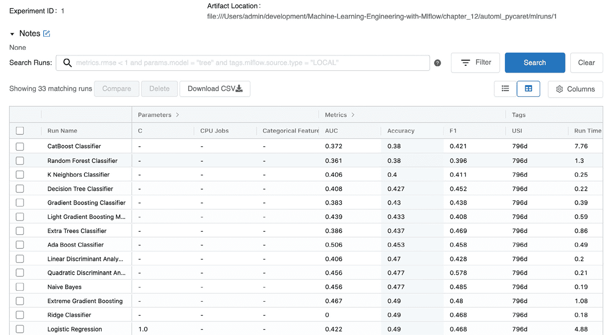

<title>B16783_12_Final_SB_epub</title>

# *第十二章【MLflow 高级话题*

在本章中，我们将介绍一些高级主题，以解决常见情况和使用案例，您可以通过使用本书其余部分中介绍的不同类型的模型来利用您的 MLflow 知识，以确保广泛的功能覆盖和各种主题。

具体来说，我们将了解本章的以下部分:

*   使用 AutoML 探索 MLflow 用例
*   将 MLflow 与其他语言集成
*   了解 MLflow 插件

我们将用模式格式的问题和解决方案的简要描述来表示每个案例——即，问题上下文和解决方案方法。

本章的不同部分并不具有连续性，因为它们处理不同的问题。

# 技术要求

对于本章，您将需要以下先决条件:

*   最新版本的 Docker 安装在您的机器上。如果您还没有安装，请按照[https://docs.docker.com/get-docker/](https://docs.docker.com/get-docker/)的指示进行操作。
*   安装了最新版本的 Docker Compose 请按照[https://docs.docker.com/compose/install/](https://docs.docker.com/compose/install/)的说明操作。
*   在命令行访问 Git，按照[https://Git-SCM . com/book/en/v2/Getting-Started-Installing-Git](https://git-scm.com/book/en/v2/Getting-Started-Installing-Git)中的描述安装。
*   访问 Bash 终端(Linux 或 Windows)。
*   访问浏览器。
*   Python 3.5 以上版本已安装。
*   如 MLflow 中的 [*第 4 章*](B16783_04_Final_SB_epub.xhtml#_idTextAnchor081) 、*实验管理所述，本地安装您的 ML 库的最新版本。*

# 使用 AutoML 探索 MLflow 用例

执行一个 ML 项目需要广泛的多领域知识，并且在很多情况下，需要深厚的专业技术。在项目中，简化采用并加速**上市时间** ( **TTM** )的一项紧急技术是使用**自动化机器学习** ( **AutoML** )，其中模型开发人员的一些活动是自动化的。它基本上由两方面的 ML 自动化步骤组成，概述如下:

*   **特性选择**:使用优化技术(例如，贝叶斯技术)选择最佳特性作为模型的输入
*   **建模**:通过使用超参数优化技术测试多个算法，自动识别一组要使用的模型

我们将探索 MLflow 与一个名为 py caret([https://pycaret.org/](https://pycaret.org/))的 ML 库的集成，它允许我们利用它的 AutoML 技术并在 MLflow 中记录流程，以便您可以自动获得针对您的问题的最佳性能。

接下来，我们将看看书中 pyStock 的用例，并看看基于我们的训练数据的自动建模。

## AutoML pyStock 分类用例

对于本节，我们将制定一个解决方案，您可以使用笔记本和我们的项目数据集(https://github . com/packt publishing/Machine-Learning-Engineering-with-ml flow/tree/master/chapter 12/automl _ py caret)遵循该解决方案。我们将执行以下步骤，以便为我们的用例实现 AutoML:

1.  让我们从安装 PyCaret 的完整版本开始，如下:

    ```
    pip install pycaret==2.3.1
    ```

2.  首先，我们应该导入必要的库，就像这样:

    ```
    import pandas import pycaret
    ```

3.  然后，我们阅读所有的训练数据，像这样:

    ```
    data=pandas.read_csv("training_data.csv",header='infer')
    ```

4.  Next, we set up the project data and load the input data, as follows:

    ```
    from pycaret.classification import *
    s = setup(data, target = 'target',  log_experiment = True, experiment_name = 'psystock')
    ```

    以下是输出:

    

    图 12.1-自动特征推断

5.  Then, we execute `compare_models()`, like this:

    ```
    best = compare_models()
    ```

    以下是输出:

    

    图 12.2–不同类型的模型

6.  通过运行以下命令选择您的最佳模型:

    ```
    best = compare_models()
    ```

7.  运行 MLflow 来检查所有的模型(在下面的**统一资源定位符**(**URL**):http://127 . 0 . 0 . 1:5000/#/experiments/1)，然后你应该会看到这样一个屏幕:



图 12.3–登录 MLflow 的模型

接下来我们将看看在我们没有目标的场景中实现 AutoML。我们将需要使用异常检测，一种无监督的 ML 技术。

## AutoML–欺诈中的异常检测

对于这一部分，我们将制定一个解决方案，您可以通过笔记本和我们的项目数据集遵循该方案(https://github . com/packt publishing/Machine-Learning-Engineering-with-ml flow/tree/master/chapter 12/automl _ py caret _ fraud)。我们将执行以下步骤，以便为我们的用例实现 AutoML:

1.  首先，我们应该导入库，就像这样:

    ```
    import pandas import pycaret
    ```

2.  Then, we read all the training data, like this:

    ```
    data=pandas.read_csv("credit_card.csv",header='infer')
    ```

    以下是输出:

    

    图 12.4–ml flow 中自动可用的模型

3.  接下来，我们设置项目数据并加载输入数据，如下:

    ```
    from pycaret.anomaly import * s = setup(df,  log_experiment = True, experiment_name = 'psystock_anomaly'))
    ```

4.  Then, we execute `compare_models()`, like this:

    ```
    models()
    ```

    以下是输出:

    

    图 12.5–不同类型的模型

5.  然后，执行您选择的异常检测模型，如下:

    ```
    iforest = create_model('iforest', fraction = 0.1) iforest_results = assign_model(iforest) iforest_results.head()
    ```

6.  接下来，运行 MLflow 来检查所有的模型(位于以下 URL:http://127 . 0 . 0 . 1:5000/#/experiments/1)，您应该会看到这样的屏幕:


图 12.6–ml flow 中自动可用的模型

在这个阶段，您应该能够利用您在本书中获得的知识，将本书中确定的模型用于生产中的模型。接下来，我们将关注 MLflow 与其他语言的集成——在本例中是 Java。

# 将 MLflow 与其他语言集成

MLflow 主要是一个根植于 ML 领域的 Python 生态系统中的工具。在其核心，MLflow 组件提供了一个**表示状态转移** ( **REST** )接口。只要做好**应用编程接口** ( **API** )包装器，就可以从任何支持 REST 的语言中访问底层代码。其余的接口在[https://www.mlflow.org/docs/latest/rest-api.html](https://www.mlflow.org/docs/latest/rest-api.html)中有详细说明；与其他语言的大部分集成都是为了在一个简洁的、特定于语言的库中提供访问 API 的层。

## MLflow Java 示例

ML 空间中的多个团队被插入到使用多种语言的上下文中。大型分布式系统上最重要的平台之一就是 **Java 虚拟机** ( **JVM** )。能够实现能够与基于 Java 的系统交互的系统对于 MLflow 与更广泛的信息技术基础设施的平稳集成是至关重要的。

我们将展示一个在 Java 中使用 MLflow 的例子(你可以在这里访问代码:https://github . com/packt publishing/Machine-Learning-Engineering-with-ml flow/tree/master/chapter 12/psy stock-Java-example)。为了在 Java 中使用 MLflow，您必须执行以下步骤:

1.  按照[https://maven.apache.org/install.html](https://maven.apache.org/install.html)的指示，安装 Java 和名为`Maven`的 Java 构建工具。
2.  使用 MLflow 客户端依赖项创建一个依赖项`pom.xml`文件，如下:

    ```
    <project> …   <dependencies>     <dependency>       <groupId>org.mlflow</groupId>       <artifactId>mlflow-client</artifactId>       <version>1.17.0</version>..   </dependency> … </project>
    ```

3.  实现你的主类，像这样:

    ```
    package ai.psystock.jclient; import org.mlflow.tracking.MlflowClient; import org.mlflow.tracking.MlflowContext; import java.io.File; import java.io.PrintWriter; public class Main {     public static void main(String[] args) {         MlflowClient mlflowClient=new MlflowClient();         String runId="test";         RunStatus = RunStatus.FINISHED;                  MlflowContext = new MlflowContext();         MlflowClient client = mlflowContext.getClient();                  client.logParam("test","alpha", "0.5");         client.logMetric("test","rmse", 0.786);         client.setTag("test","origin","HelloWorldFluent Java Example");          mlflowClient.setTerminated(runId, runStatus, System.currentTimeMillis());     } }
    ```

4.  用 Maven 构建您的项目，如下所示:

    ```
    mvn clean package
    ```

5.  通过运行下面的代码来执行您的 Java 项目:

    ```
    java -jar ./target/java-maven-command-line-1.0-SNAPSHOT.jar
    ```

在这个阶段，MLflow 被原生集成到 Python 生态系统中。它提供了到其他生态系统的链接，类似于我们在本章中用 JVM 语言演示的内容。接下来我们将探索一个 R 语言的例子。

## MLflow R 示例

我们将展示一个使用 Databricks 环境在 R 中使用 MLflow 的示例(您可以在这里访问代码:[https://github . com/packt publishing/Machine-Learning-Engineering-with-ml flow/tree/master/chapter 12/ml flow-example-R](https://github.com/PacktPublishing/Machine-Learning-Engineering-with-MLflow/tree/master/Chapter12/mlflow-example-r))。您可以从 Databricks Community Edition 环境中导入笔记本，并从那里研究代码。

在这一节中，我们将在 R 中运行一个随机森林分类器，它覆盖了作为 R 包提供的标准数据集，称为`Pima.tf`([https://rdrr.io/cran/MASS/man/Pima.tr.html](https://rdrr.io/cran/MASS/man/Pima.tr.html))。这是一个简单的数据集，具有一组生物医学特征，用于检测特定患者是否患有糖尿病。

为了为您的 R 示例代码创建一个笔记本，您需要执行以下步骤:

1.  在[https://community.cloud.databricks.com/](https://community.cloud.databricks.com/)注册 Databricks 社区版并创建一个帐户。
2.  使用您刚刚创建的凭据登录您的帐户。
3.  Create a cluster to use for your workloads. You are allowed to have clusters for your workloads with a limit of 15 **gigabytes** (**GB**) of **random-access memory** (**RAM**) and with usage for a defined period of time.

    您可以在下面的屏幕截图中看到集群创建过程的概述:

    

    图 12.7–在 Databricks Community Edition 中创建集群

4.  Create a new notebook in your Databricks platform on your landing workspace page by clicking on the **Create a Blank Notebook** button in the top right of the page, as illustrated in the following screenshot:

    图 12.8–在 Databricks Community Edition 中创建新笔记本

5.  We are now ready to start a notebook to execute a basic training job in this managed environment. You can start by clicking on **New Notebook** in your workspace. You need to set the default language as **R** and attach the notebook to your cluster created in the previous chapter.

    您可以在下面的屏幕截图中看到笔记本创建过程的概述:

    

    图 12.9–添加新 R 笔记本的详细信息

6.  通过`install.packages`导入 MLflow 依赖项并实例化库，在笔记本上开始，如下:

    ```
    install.packages("mlflow") library(mlflow) install_mlflow()
    ```

7.  现在，我们将继续安装额外的包，其中包含执行我们的示例所需的数据。在这个特殊的例子中，我们将使用`carrier`包来简化远程函数的操作并记录关于它们的信息。我们还将包括`MASS`包，它包含我们将在本例中使用的数据集。`el071`包和`randomforest`将用于统计功能和运行预测分类器。以下是您需要的代码:

    ```
    install.packages("carrier") install.packages("e1071")   library(MASS) library(caret) library(e1071) library(randomForest) library(SparkR) library(carrier)
    ```

8.  接下来，我们将重点关注通过用下面这行代码开始一个代码块来开始实验:`with(mlflow_start_run(), {`。这将基本上允许我们通过`mlflow_log_param`功能开始记录模型参数。在以下情况下，我们将在 MLflow 中记录在算法的每次分割中随机采样的树的数量(`ntree`)和特征的数量(`mtry`)。代码如下面的代码片段所示:

    ```
    with(mlflow_start_run(), {      # Set the model parameters   ntree <- 100   mtry <- 3     # Log the model parameters used for this run   mlflow_log_param("ntree", ntree)   mlflow_log_param("mtry", mtry)
    ```

9.  在接下来的两行中，我们通过指定`Pima.tr`训练数据集并添加算法参数来实例化`random forest`算法。然后我们使用`Pima.te`测试数据进行预测。代码如下面的代码片段所示:

    ```
      rf <- randomForest(type ~ ., data=Pima.tr, ntree=ntree, mtry=mtry)      pred <- predict(rf, newdata=Pima.te[,1:7])
    ```

10.  我们现在可以通过`caret`包中可用的`confusionMatrix`方法来关注于计算模型性能的度量——在这种情况下，是特异性和敏感性，如下所示:

    ```
    # Define metrics to evaluate the model   cm <- confusionMatrix(pred, reference = Pima.te[,8])   sensitivity <- cm[["byClass"]]["Sensitivity"]   specificity <- cm[["byClass"]]["Specificity"]      # Log the value of the metrics    mlflow_log_metric("sensitivity", sensitivity)   mlflow_log_metric("specificity", specificity)
    ```

11.  我们现在可以专注于上传基于之前指标的混淆矩阵图。R 中实现模型登录的方法是`mlflow_log_artifact`。下面是您需要的代码:

    ```
      # Log the value of the metrics      # Create and plot confusion matrix   png(filename="confusion_matrix_plot.png")   barplot(as.matrix(cm), main="Results",          xlab="Observed", ylim=c(0,200), col=c("green","blue"),          legend=rownames(cm), beside=TRUE)   dev.off()      # Save the plot and log it as an artifact   mlflow_log_artifact("confusion_matrix_plot.png")
    ```

12.  最后，我们可以序列化模型函数并将其记录在 MLflow 中，这样就可以通过使用`carrier`包中的`crate`方法，从另一个 R 笔记本中重用它。我们最终用`mlflow_log_model`记录模型，并在最后一行用括号结束代码，如下面的代码片段所示:

    ```
      predictor <- crate(function(x) predict(rf,.x))   mlflow_log_model(predictor, "model")      })
    ```

13.  现在，您可以自由地在您的环境中探索**实验**选项卡，您应该可以访问您的模型日志，并且能够探索运行的指标和细节，如下面的屏幕截图所示:


图 12.10–ml flow 中自动可用的模型

在这一节中，我们探索了 Java 和 R 语言中的例子，对于工程师和数据科学家来说，它们是 ML 生态系统中极其相关的语言。我们现在将深入研究通过插件扩展 MLflow 功能。

# 了解 MLflow 插件

作为一名 ML 工程师，在你的项目中，你可以多次达到框架的极限。MLflow 通过其插件特性提供了一个扩展系统。插件架构允许软件系统的可扩展性和适应性。

MLflow 允许创建以下类型的插件:

*   **跟踪存储插件**:这种类型的插件控制和调整用于在特定类型的数据存储中记录实验指标的存储。
*   `log_artifact`和`download_artifacts`。
*   `git_tags`和`repo_uri`，以及系统环境的其他相关元素。
*   **模型注册库**:此功能允许您自定义模型的存储位置；例如，你可以将它们存储在一个**安全文件传输协议** ( **SFTP** )系统中，如果这是你存储生产基础设施模型的唯一方法。在受监管的环境中，只有有限的一组服务和您的模型注册库需要适应这种情况，这个特性可能是有利的。
*   MLflow 项目部署:这种类型的插件控制并调整你的部署方式。如果您的部署不是针对 MLflow 支持的环境，您可以使用此功能来专门化您的部署方式。
*   **请求头提供者**:使您能够控制 MLflow 发出的 REST 请求并向其添加额外的值。一个例子是，如果所有的**超文本传输协议** ( **HTTP** )请求都需要一个与你的网络中的安全令牌相关的头密钥，该安全令牌与公司的**单点登录** ( **SSO** )相集成。
*   **项目后端**:这为在不同的执行环境中运行 MLflow 提供了可扩展性。例如，Kubernetes 是一个后端，也是一个 Sagemaker，因此 MLflow 和模型部署环境的集成需要针对每种情况的特定代码。

要创建一个插件，你需要创建一个 Python 包来覆盖 MLflow 中的特定模块。我们将从官方文档中逐步开发一个示例 MLflow 插件。您可以跟随以下存储库 URL:https://github . com/packt publishing/Machine-Learning-Engineering-with-ml flow/tree/master/chapter 12/ml flow-psy stock-plugin。要完成该过程，请遵循以下步骤:

1.  在`setup.py`文件中定义你的插件。第`install_requires=["mlflow"]`行代码将 MLflow 与您的包捆绑在一起，足以安装您的新插件包，它将创建 MLflow 的一个已更改的实例。代码如下面的代码片段所示:

    ```
    setup(     name="mflow-psystock-deployment-plugin",     # Require MLflow as a dependency of the plugin, so that plugin users can simply install     # the plugin and then immediately use it with MLflow     install_requires=["mlflow"],     entry_points={         "mlflow.deployments": " psystock target= psystock. deployment_plugin"     } )
    ```

2.  在名为`mlflow-psystock-deployment/_init_.py`的文件夹中创建一个包名称空间空文件，以表示创建了一个包。
3.  The next step involves overriding the creation of a file with methods that we want in our plugin to override the default behavior in MLflow.

    在我们的具体例子中，我们将考虑在 MLflow 中覆盖`BaseDeploymentClient`类，这基本上意味着我们需要实现所有的方法。我们将实现一组虚拟方法来说明这个过程，从`create_deployment`和`update_deployment`方法开始，如下所示:

    ```
    import os
    from mlflow.deployments import BaseDeploymentClient
    p_deployment_name = "pystock"
    class PluginDeploymentClient(BaseDeploymentClient):
        def create_deployment(self, name, model_uri, flavor=None, config=None):
            if config and config.get("raiseError") == "True":
                raise RuntimeError("Error requested")
            return {"name": f_deployment_name, "flavor": flavor}
        def delete_deployment(self, name):
            return None
        def update_deployment(self, name, model_uri=None, flavor=None, config=None):
            return {"flavor": flavor}
    ```

4.  We then implement the `list_deployments` and `get_deployments` methods, as follows:

    ```
        def list_deployments(self):
            if os.environ.get("raiseError") == "True":
                raise RuntimeError("Error requested")
            return [f_deployment_name]
        def get_deployment(self, name):
            return {"key1": "val1", "key2": "val2"}
        def predict(self, deployment_name, df):
            return "1"
    def run_local(name, model_uri, flavor=None, config=None):
        print(
            "Deployed locally at the key {} using the model from {}. ".format(name, model_uri)
            + "It's flavor is {} and config is {}".format(flavor, config)
        )
    ```

    `run_local(name, model_uri, flavor=None, config=None)`方法是这个插件实例化时执行的主要方法。

5.  您现在可以通过运行下面的命令在 **MLflow** 之上安装您的插件:

    ```
    pip install-e .
    ```

我们在这一节结束了这本书，用新的功能扩展 MLflow，允许你作为 ML 工程师在任何有意义的时候扩展 MLflow。

# 总结

在本章中，我们讨论了一些用例，例如 MLflow 管道。我们研究了在两种不同的场景中实现 AutoML。在我们没有目标的地方，我们将需要使用异常检测作为无监督的 ML 技术。讨论了非基于 Python 的平台的使用，并总结了如何用插件扩展 MLflow。

在这个阶段，我们已经使用 MLflow 解决了 ML 工程领域中广泛而深入的主题。你的下一步肯定是探索更多，并在你的项目中利用本书中学到的技术。

# 延伸阅读

为了加深您的知识，您可以参考以下链接中的文档:

*   https://pycaret.org/about
*   【https://www.mlflow.org/docs/latest/plugins.html 